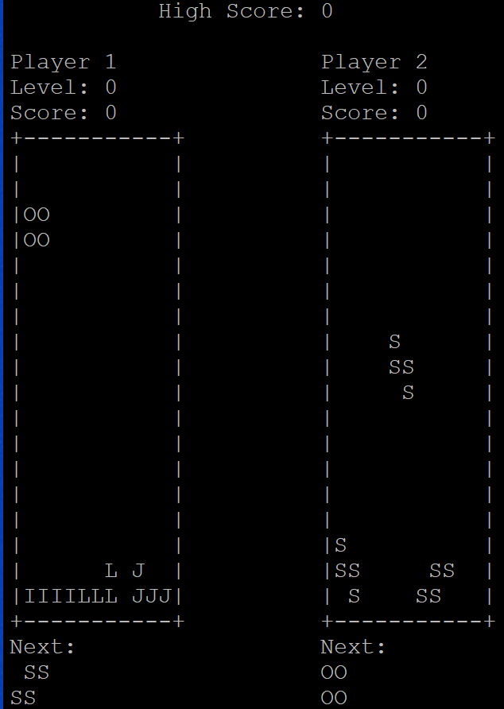
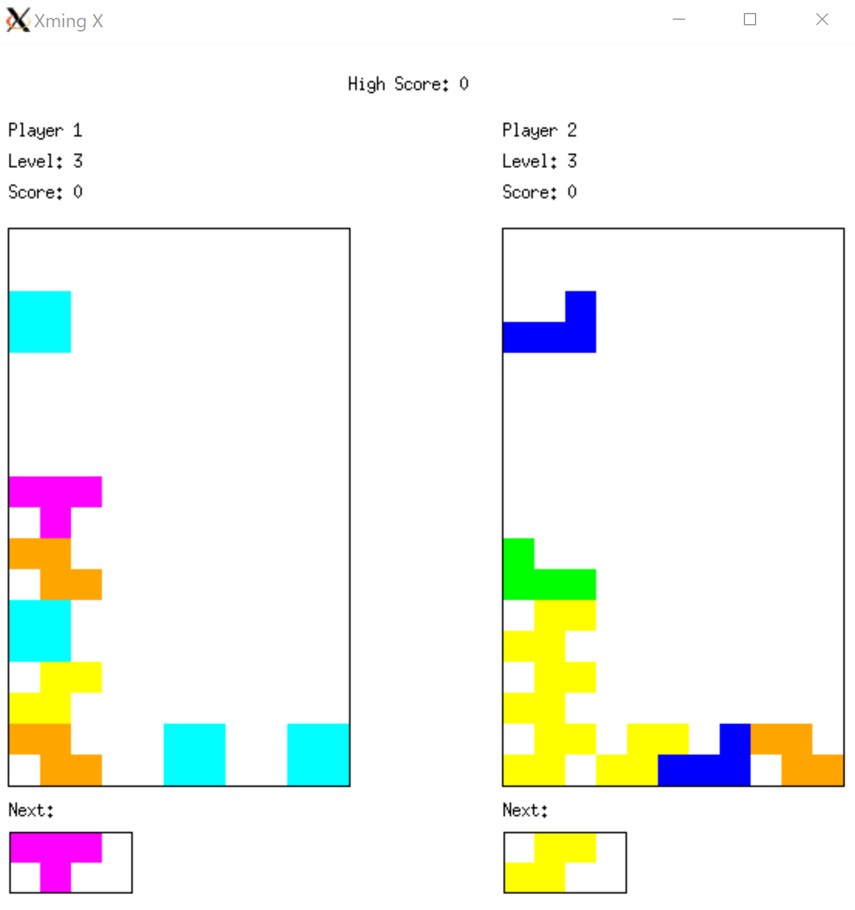

# Tetris

A variation of Tetris called Biquadris is a 2 player game where players have unlimited time to decide their next move. Each player has their own grid with the dimensions of 18 rows and 11 columns where they try to clear the rows as the blocks appear on the display. Players can increase or decrease their levels at their own discretion. As the level increases, the points earned upon clearing the rows also increase. If a player’s board is filled, the other player wins.

This repository is about the Biquadris Project which was the final project for CS 246. The source code is available to view upon request, but is not open to the public due to Policy 71 of the University of Waterloo.

It has two display settings:

 
